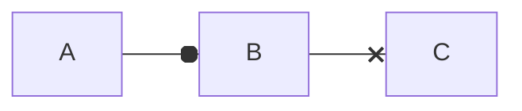

# Mkdocs 


## Listas

### Não ordenadas
 - item A
 - item B

*italico*

## Alteracoes de texto

**Negrito**

## Citacoes

1. Primeiro
2. Segundo
3. Terceiro

Emoji - :snake: :heart:

˜˜tachado˜˜

==realçado==


> Esta e uma citacao

`codigo=42`


## Link 

[DuckDuckGO](https://duckduckgo.com/)

## Tabela

| Nome | Idade |
| ---- | ----- |
| Edson|  53   |
| Jane |  51   |


## Lista de tarefas

- [ ] Like Video
- [ ] Incricao Canal
- [x] Assistir a live de mkdocs

## Bloco de codigo


```{.py3 hl_lines="1 3" linenums="55" title="meu_arquivo.py"}
def xpto():
   """Docstring."""
   return True
```
## Custom fences



For full documentation visit [mkdocs.org](https://www.mkdocs.org).

## Project layout

    mkdocs.yml    # The configuration file.
    docs/
        index.md  # The documentation homepage.
        ...       # Other markdown pages, images and other files.
